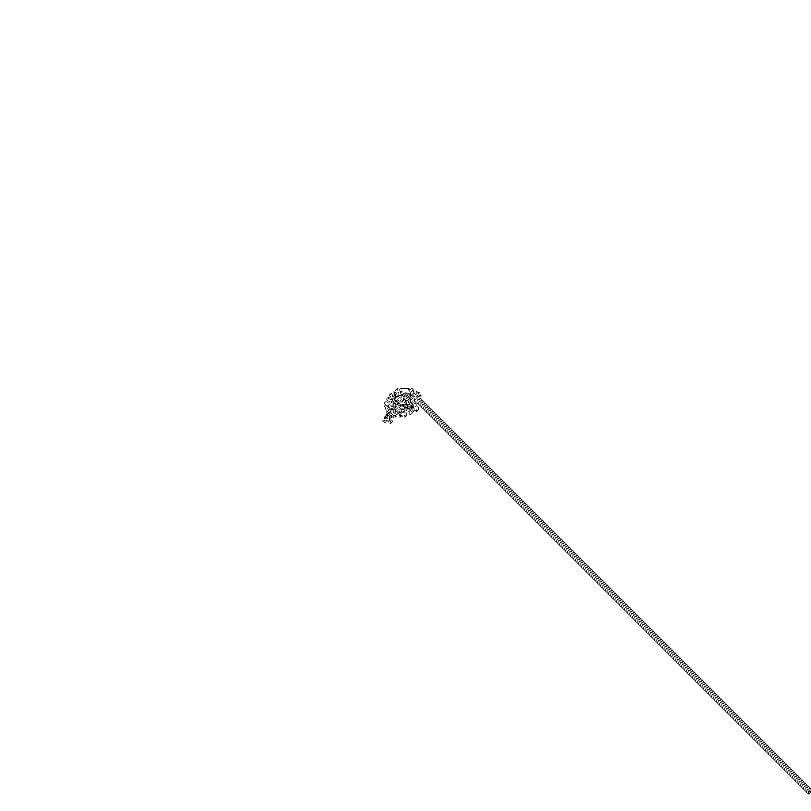

## Тестовое задание

```
На белом поле размером 1024x1024 клеток, в позиции 512,512 находится “муравей”
Муравей двигается по следующим правилам: На белой клетке - поворачивает на 90° по часовой стрелке, 
инвертирует пиксель и перемещается вперед на одну клетку На черной клетке - поворачивать на 90° против часовой стрелки, 
инвертирует пиксель и перемещается вперед на одну клетку Изначально муравей находится на белой клетке и смотрит вверх. 
Пришлите изображение пути муравья до границы поля в виде BMP или PNG файла глубиной цвета 1 бит и число черных клеток на нем. 
Программа должна минимизировать использование RAM
```

## Результат

Число черных клеток - 3679
## Решение

Для начала была реализована функция create_start_field, которая создает пустое поле в нужном формате. 
Основная функция - ant_movement. Она создает новую картинку по переданному пути и возвращает количество черных точек.
Программа минимально потребляет ресурсы RAM. Работа идет напрямую с изображением не создавая других массивов для обработки.
